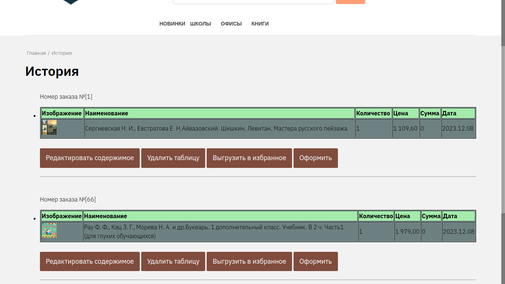
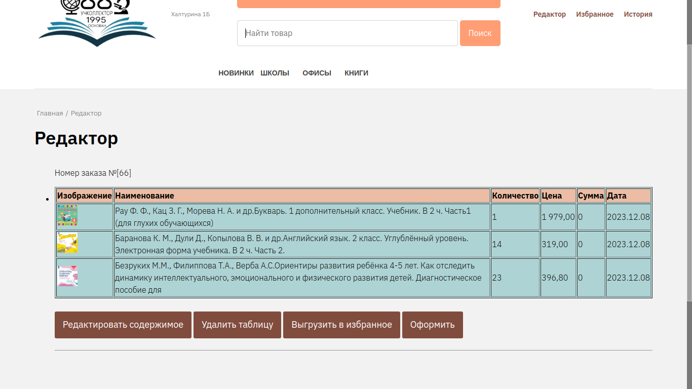
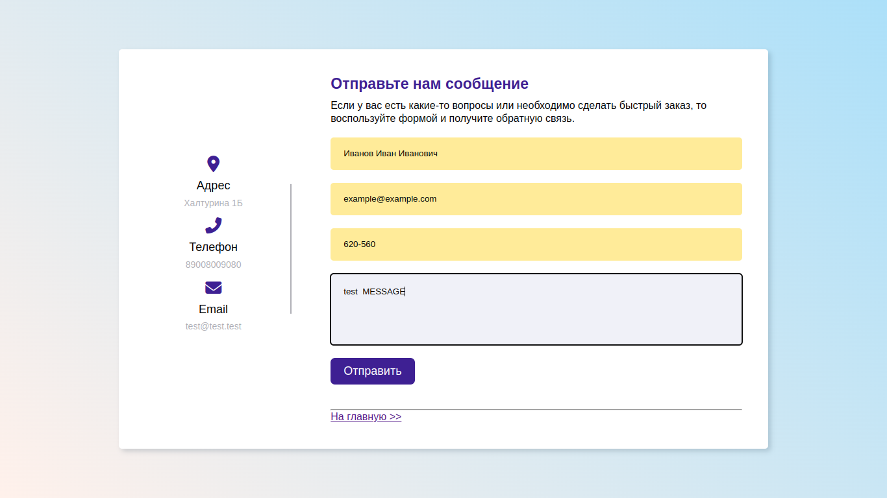

# dbook_rzn

This repository - official site

> Requires
---

> Settings and config
---

> Launch
``` bash
cd backend
go run main.go / ./main
```
***


> Demo screen
Web-interface
***
Target list / search  page


Old page add books


History orders page

Editor orders page

Fast mail page
